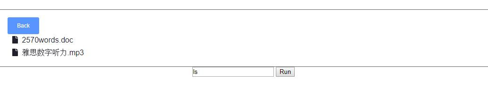

### BaiduPCS-Go 百度网盘客户端 WEB UI

这个是 project 只提供 UI 部分， 核心代码在 https://github.com/iikira/BaiduPCS-Go

### 截图



### 前言

本人自用的 UI，只提供简单的链接。可以放在远程服务器里面快速实现离线下载。

### Docker

```
docker build -t baidupcsui .
docker run -d -p 80:3000 -v /downloads:/usr/src/app/download/ baidupcsui
```

### 配置

配置你的登录密码

```
修改index.js里面的
const PASSWORD = 'YourPassword';
```

### 登录

非常重要在输入框里面输入一下内容，点击 run
`login -bduss=YOURBUDSS`

`ls`
得到目录内所有文件

### 核心代码更新

在这里下载 最新版本的`linux-amd64.zip`并解压到根目录

https://github.com/iikira/BaiduPCS-Go/releases
